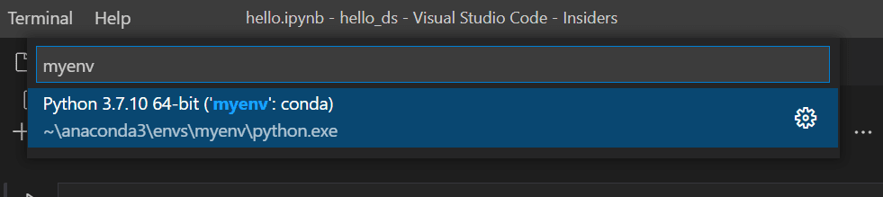

# Lab 1: Project Setup and Introduction to Copilot

## Getting Started

1. **Open VS Code** and let's start from scratch.
2. **Navigate to GitHub Copilot Chat** and enter `/help` to explore the available built-in helper commands. You'll experiment with them shortly!

## Project Bootstrap and Data Reading

Let's create our project for data exploration using the Titanic dataset:  
[Titanic Dataset CSV](https://raw.githubusercontent.com/MicrosoftDocs/mslearn-introduction-to-machine-learning/main/Data/titanic.csv)

### 🎯 Prompt (Agent Mode)

```
/new Create a new Python data science project to analyze Titanic survival data.  
- Scaffold the project structure following Python data science best practices.
- Add a Jupyter notebook to the project.
- In the notebook, include code to read the Titanic dataset from:  
  https://raw.githubusercontent.com/MicrosoftDocs/mslearn-introduction-to-machine-learning/main/Data/titanic.csv
```

> **Note:** Use the environment created in Prerequisites.




### Reflection Questions

- Did it generate the structure you expected? 
- You can iterate by changing the prompt or with follow-up commands in the chat.

### Follow-up: Best Practices Research

Use "Ask" mode to find out best practices for project bootstrap in data science using Python.

### 🎯 Prompt (Ask Mode)

```
What are the recommended best practices for setting up (bootstrapping) a new data science project using Python and Jupyter notebooks?
```

### Advanced Tip: Model Selection

If you've worked with Copilot before, now you have time to experiment with different models:  
[Choosing the Right AI Model for Your Task](https://docs.github.com/en/copilot/reference/ai-models/choosing-the-right-ai-model-for-your-task)

You can go a step further: describe your task and ask GitHub Copilot to suggest models by providing a link to the documentation with: #fetch https://docs.github.com/en/copilot/reference/ai-models/choosing-the-right-ai-model-for-your-task

---

➡️ **[Next: Lab 2 Refactor for Success →](Lab%202%20Refactor%20for%20Success.md)**

